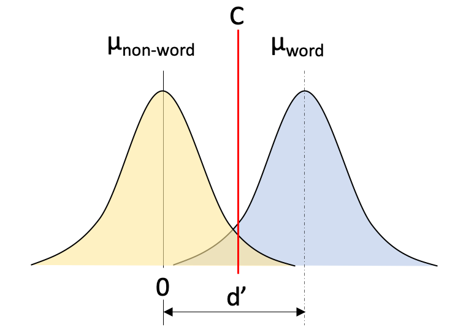
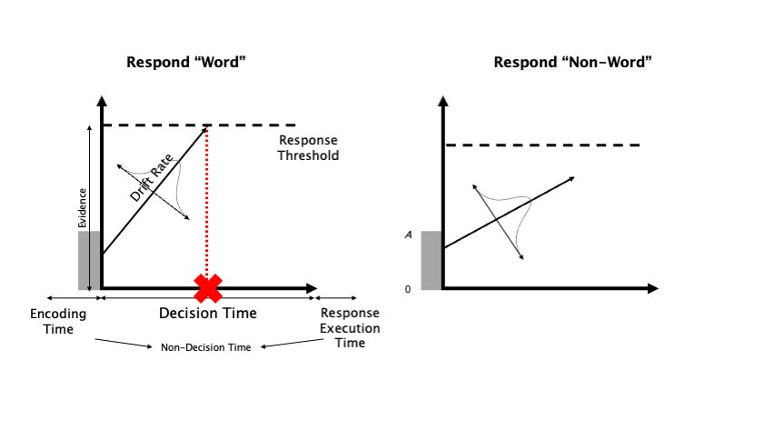
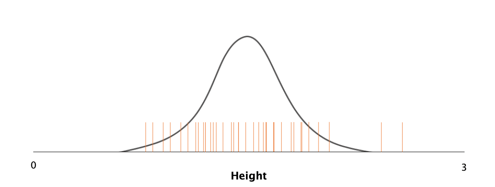
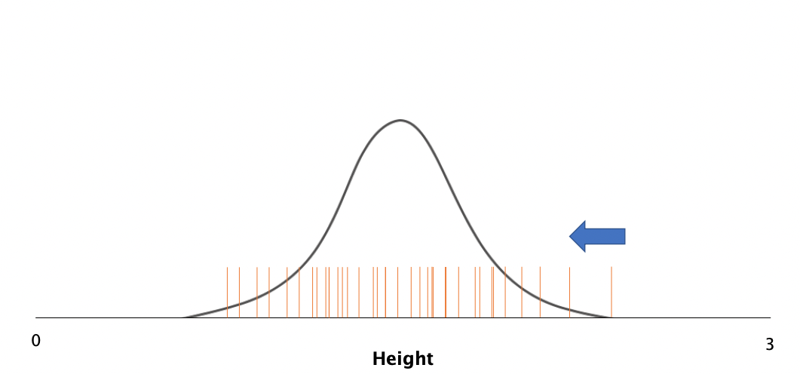

```{r setup, include=FALSE}
knitr::opts_chunk$set(collapse = TRUE, fig.path = "static")
```

In this blog post, I explain what I do as a cognitive modeller - from decision making modelling, to neuroscience, fitting mathematical models to human data and more!

<!-- more -->

# I thought you were a psychologist?

I hear this too often, and technically, we are a type of psychologist in that we study ('ology') cognition ('psych'). Cognition just means how we think and process things - by reading this now, you're processing the information, a form of cognition! Cognition includes many processes we use daily, like memory, detecting signals and making decisions (that's where we come in).

## Okay so you look at decision making?

As a decision modeller, we look at decision making. I've had colleagues that have looked at all types of decision making, from the very simple decisions ("is this light red or green?"), to more complex decisions involving memory ("have you seen this image before?"), risk ("would you rather have a 90% chance at `$10` or a 10% chance at `$90`?) and consumer preference ("would you rather chocolate by brand A or chips by brand B). 

In all of these examples, we often collect lots of data from lots of people. So if you were to do one of our experiments, you'd probably be (bored) asked to make a lot of **simple**, seemingly repetitive decisions about the thing we're investigating. 


## Right, so what do you find? And why is this even important?

Understanding the decisions people make can have huge consequences for a variety of things - safety, consumer choices, health and medical decisions and even voting behavior. 

See when you make any decision, there are two key outcomes we're interested in, and this holds for many applications. The **choice** you make and the **speed** in which you make that choice. Imagine you're deciding on what to have for dinner, if you and your partner go back and forth over this for a long time, your partner might not be convinced by your choice. But say you made a choice instantly, this shows some pre-planning and confidence in your decision. These underlying factors that underpin both your choice and speed of making the choice (which we call response time) are what makes the topic important.

Let's take another, more consequential decision - deciding on the colour of traffic lights. If the light was difficult to see (late afternoon sun making it hard to make out the colours), you might take longer to make a decision, and in the worst circumstance, you may even make the wrong decision! If it's night time and easy to see, then you'll probably make a fast, accurate decision. 

But that's not all that goes into a decision. What if you're running late, then you might be biased to see a green light and more likely to make a wrong decision. What if you're a cautious driver? You might slow down coming to the light and take longer to commit to a decision. All these elements play a part in decision making and, the coolest part, we can disentangle them.

## How do you do this?

We do this through mathematical models. See in decision making research, we have some input (i.e., the question "is this light red or green") and we get some output (a choice and response time), but what we really want to know is what components make up that choice. We want to understand the black box that is the processing of the information to execute a decision. 

So we call these models "process models", because they help us understand the *process* of decision making. In  psychological research there are lots of examples of models, from memory models that help us understand how we encode and retrieve information, to learning models that help us understand how we update our knowledge and representations of the world. Then there are decision models which help us break down response times and choices that we make. 

# Decision-Making Modelling

Luckily, many smart people have worked on improving our models over time. When you think about it, there's a few things a model should achieve. It should be;

- flexible and able to account for the phenomenon under many conditions
- not too complex - too much complexity means it's difficult to understand or gain information from
- representative of the system and account for specific things we know about already
- testable (and falsifiable)
- able to produce data that is similar to what we observe. 


These last two points are where mathematical models come in. Let's take a model like this figure below. This model is for decisions in a task where someone is asked to say whether a string of letters is a word or a "non-word".

```{r, echo=F}

```

Here we can see a few features. First, there are two *distributions* (blue and yellow). These make up the representation of "words" and "non-words" in the persons mind. You'll notice they overlap - this is because we probably have some instances where we're not really sure whether an item is a word or not. Secondly, you'll notice a red line - this is labeled the criterion. If I was to take a random string of letters (say `PONK`) and was to sample a point along this line, you would have some form of certainty of how much of a word this was. If you thought (correctly) that it was NOT a word, the value assigned here might be around 0 (middle of the yellow distribution). Because your sample of information falls on the left of the criterion, the model says that you would respond "non-word". And that's it!

So let's think then, if we had more tricky words, your sample might fall closer to the criterion, so you might be more likely to make a mistake. What if you had just learned the language? Then maybe those distributions would overlap more as it's harder to decide. In other instance, you might have already heard from your friend that 90% of the items in the test are words. Here, you'll probably be biased to say "word", so the model moves your criterion to the left, so there is a greater chance of responding "word" (and making errors when it's actually a "non-word")


## Including response times

This model is nice and provides an explanation about mental representations of words. But what if we want to include response times? For this, we use response time models. 

These models make a few assumptions about how we make decisions. The theory is that for each decision that we make, we gather *evidence* for each option. So when deciding on dinner you might be deciding whether to cook fish or cook burgers. If you have fish in the fridge, this might give you some evidence for choosing "fish". But burgers taste good, sooo some evidence for burgers. But ultimately you think the fish is probably better for you, so you eventually choose fish.  

This "eventually" point, where you make a decision, is just like the criterion from the last model. We call this a threshold. When you've gathered enough evidence and reached this point for a choice option, you execute the choice. The speed at which you gather evidence is called the drift rate. Finally, there is a bit of time that is spent encoding information and executing the decision (very very minute amounts of time around 200 miliseconds) and this is labeled "non-decision time". All of these components can be seen below. 


```{r, echo=F}

```

In this example, we can see another word vs non-word choice. On the left, the evidence for "word" and on the right, the evidence for deciding "non-word". This time, our stimulus is `FOLK`. You'll notice that the *threshold* is lower for "non-word" - this means there is some bias, so we might've just seen 5 non-words in a row, or there might be very few words in this test. 

Secondly, you'll see that drift rate is faster (i.e., the slope is steeper) for "word". This means we've gathered evidence faster. Drift rate is thought to reflect processing speed and urgency, so the difference between drift rates is a good indicator of how easy the task is. If the difference between the correct answer and incorrect answer is really big, then the task is easy, whereas if the difference is small, the task is probably harder (similar to our overlapping distributions in the previous example).

Next, you'll also notice the parts at the start and end that are added on for non-decision time. In the model, we simply subtract this time from the response time so that we can asses the time that was spent on actually processing and deciding. 

Now for the maths - and this is really quite simple! The response time is something we know (let's say it took 600 miliseconds to make this choice). Then the response time (taking away non-decision time) is found by dividing the threshold by the drift rate (slope)! As we get more complex there's other things to conisder too -- such as how high the evidence began accumulating at (it's about the same here). 


## Speed-Accuracy Tradeoff

One thing you may have noticed about decision making is that a trade off exists. You can go faster and make faster decisions, but this often means more errors. You could also try and be more accurate, but this often means slowing down. This is called the speed-accuracy tradeoff and is very well studied.

In our experiments, we might tell people to "be fast" sometimes, and other times to "be accurate". The results are as you would expect - faster response times and lower accuracy for "be fast" and the opposite for "be accurate". 

Now, with our models, we can work out what happens here, and the result is very neat. All we do is change our threshold! Looking at this example, it might not be immediately clear how this works, but here's some more details about the model, which are shown below. The drift rate is actually a distribution, so it's variable from one decision to the next. This means with a lower threshold, a slightly slow drift rate would lead to an arrow - something that is less likely with a high threshold (where we would wait for more evidence)!


```{r, echo=F}

```


## Modelling

You might be wondering how we work out the values in these models. How can we tell whether one threshold is higher than the other? Especially with so much data for so many people!

For this, we use model estimation techniques and probability theory. Using all the data, we can pick out some values to include in the model - let's say drift rate = 2, threshold = 0.5, non-decision time = 0.1. These numbers are arbitrary alone, but when combined, give us a response time distribution. The model estimation takes in these guesses, and applies them to our observed data, and then gives us a *probability* that these values are the *true* values.

We then repeat this process many many times, each time trying to find better guesses, until we get the *most likely parameter estimates*. This just means we've found values that are likely to result in the data we observed. And the cool part - we can then put these likely values back into the model and generate new data! If the model works, the new (predicted) data should look just like what we observed!

From this process, we can test all kinds of things - the different in parameters between people, the difference over different conditions and manipulations, as well as which parameters are affected by different manipulations. For example, we know that harder tasks lead to slower drift rates! From this, we can gain an insight into the process. So when the task is harder, people are slower to process the information! And then vice-versa, if people are slower to process information, it may be too hard to perceive. 

## More examples

Imagine you're selling a product on a website, then understanding the consumers behaviour could help you sell more products. If on test A, people clicked "buy" a lot quicker than in test B, then the model might conclude that the information was easier to absorb, or, maybe there was a lower price or more persuasive text that made them more confident in their decision. 

Another interesting aspect is the difference between people. In this online shopping example, we might find that person A is just slow to respond, which is caused by being more cautious compared to other people, where the other people are just slower to take in the information. We overcome this by using **hierarchical models**.

## Hierarchical Models

Hierarchical models have two main levels - each individual has a set of values for their model parameters, and then these help to establish the group's parameters. In this shopping example, a big company might only care about the group level, because that is the best way to sell more products to more people. But we may also want to know about each individuals behaviour.

The strength of hierarchical models comes from what we call *shrinkage*. Let's imagine a model that guesses peoples height. These guesses may resemble a normal distribution, just like below.


```{r, echo=F}

```

You'll notice that most of the guesses are around the mean, right in the middle, which makes this distribution. You'll also notice that two of the guesses (on the right) are a bit extreme. In hierarchical modelling, shrinkage helps to pull these extreme values back into a normal range, just like below.


```{r, echo=F}

```


So the important point here is that the individuals inform the group, but the group also informs the individuals. This relationship helps us get the best possible estimates for our model parameters as possible, so that we can answer really difficult research questions.


# You mentioned neuroscience?

Alright, final point. There are now some neuroscience researchers who are using these modelling techniques along with their EEG and fMRI measures! This means that they can look to see how different processes affect the brain - i.e., what parts of the brain light up when I'm being more cautious? And what happens in clinical patients who may display different behaviour? Maybe models can help find improve behavioural therapy by helping us understand the process of the behaviour!

- Reilly

